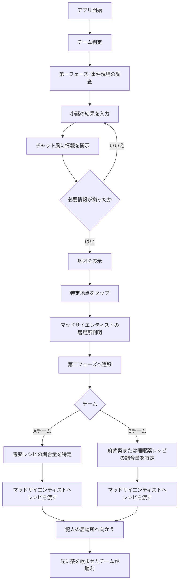

# 進行補佐アプリ 進行フロー

## 目的

2チームに分かれて謎解きを進めるイベントで、進行フェーズやチームごとの役割に応じて、閲覧者へ開示する情報を切り替える。

このアプリでは謎そのものは出題しない。紙、会場内の掲示物、小物、暗号、スタッフ演出などで解いた結果として得られる「数字」「記号」「合言葉」などを入力し、それに応じてストーリー情報、ヒント、調合情報、地図情報を開示する。

## 世界観

世界征服サミットの最中、マフィアの参謀が毒殺される。

会場には複数の組織が集まっており、事件の真相を追う者、犯人を先に確保したい者、情報を隠す者が入り乱れている。

参加者は2チームに分かれる。

- Aチーム: 犯人を突き止め、復讐のために毒薬を用意したいマフィアチーム
- Bチーム: 犯人から事情聴取するため、先に拘束したい対立組織チーム

第一フェーズでは両チームとも、毒薬を作った人物としてマッドサイエンティストを疑い、その居場所を突き止める。

第二フェーズではチームごとに目的と開示情報が分岐する。マッドサイエンティスト役に必要なレシピを渡し、犯人の居場所へ向かうところまでがゴールとなる。

最終的には、先に犯人へ薬を飲ませたチームが勝利する。

## 用語

| 用語 | 意味 |
| --- | --- |
| 参加者 | アプリを閲覧するプレイヤー |
| チーム | AチームまたはBチーム |
| ボス | チャット風UIで連絡を取る各組織の上司役 |
| 小謎 | アプリ外で解く謎。アプリ内では問題文を扱わない |
| 開示情報 | 小謎の結果入力によって表示されるストーリー、ヒント、調合情報など |
| 第一フェーズ | マッドサイエンティストの居場所を探すフェーズ |
| 第二フェーズ | チームごとに目的が分岐し、犯人の居場所へ向かうフェーズ |
| レシピ | 薬の種類と調合量を示す情報 |
| 地図 | 第一フェーズ終盤で、マッドサイエンティストの居場所を特定するための画面 |

## 全体フロー

## チーム判定

ログインやユーザー識別は行わない。

アプリを閉じても、同じブラウザであればチームと開示済み情報が保持される状態にする。

### 案1: チーム別QRコード

Aチーム用URLとBチーム用URLを別々に用意する。

例:

- `/team/a`
- `/team/b`

初回アクセス時にチーム情報をブラウザへ保存する。

メリット:

- 受付や配布物でチームを分けやすい
- 参加者がアプリ内で間違ったチームを選ぶリスクが低い
- 運営側でQRコードを差し替えれば導線を制御しやすい

懸念:

- QRコードの配布ミスがあるとチームが混線する
- URLを共有されると別チーム画面を見られる可能性がある

### 案2: アプリ内でロール付与

初回表示時にAチームまたはBチームを選択する。

メリット:
## UIイメージ

### メイン画面

- 上部にチーム名と現在フェーズ
- 中央にチャットログ
- 下部に入力欄
- 必要に応じて固定ボタンを表示

表示ボタン例:

- 情報一覧
- 地図を見る
- レシピを確認
- 第二フェーズへ進む
- 犯人の居場所へ向かう

### チャット表現

ボスからのメッセージ例:

> 事件現場の状況は確認したな。毒は素人の仕事じゃない。研究薬品の線を洗え。

プレイヤー入力後の反応例:

> その記号、被害者のグラスに残っていた刻印と一致する。マッドサイエンティストの研究室に繋がるかもしれない。

Aチーム向け例:

> 復讐には確実な一撃が要る。レシピの調合量を間違えるな。

Bチーム向け例:

> 殺すな。喋らせる必要がある。拘束に使える配合だけを拾え。

## 運営用の想定操作

必要に応じて、運営・開発確認用の機能を用意する。

- 保存状態のリセット
- チーム切り替え
- フェーズ強制変更
- 全情報開示
- 入力コード一覧の確認

本番では誤操作やネタバレを防ぐため、通常参加者には見えない導線にする。

## 勝利条件

第二フェーズで必要なレシピ情報を集め、マッドサイエンティスト役に正しいレシピを渡す。

その後、犯人の居場所へ向かい、先に薬を飲ませたチームが勝利する。

アプリ上では勝敗判定を自動化しない想定。最終判定は現地スタッフまたは演出で行う。

## 実装時の優先度

### 必須

- チーム判定
- ブラウザ内保存
- 第一フェーズの情報開示
- チャット風UI
- 開示済み情報一覧
- 地図画面
- 第二フェーズへの遷移
- 第二フェーズのチーム別情報開示

### あるとよい

- 運営用リセット
- 開発用の全開示モード
- 入力履歴の表示
- 不正解入力時の短いリアクション
- 音や軽いアニメーションによる開示演出

### 今回は対象外

- ログイン
- 個人ユーザー識別
- サーバー連携
- リアルタイム同期
- アプリ内での謎そのものの出題
- アプリによる勝敗の自動判定

## 未確定事項

- チーム分けはチーム別QRコード方式にするか、アプリ内選択方式にするか
- 地図は画像で作るか、HTML/SVGで作るか
- 第二フェーズでBチームが使う薬を麻痺薬にするか、睡眠薬にするか、選択式にするか
- 入力コードの数と種類
- 第一フェーズで必要な情報数
- 第二フェーズのレシピ調合ロジック
- 犯人の居場所の開示タイミング
- 運営用機能を本番UIに残すか、開発用URLに分けるか

## 次に決めること

1. チーム判定方式を決める
2. 第一フェーズの入力コードと開示情報を確定する
3. 地図上の候補地点と正解地点を決める
4. 第二フェーズのAチーム用レシピ条件を作る
5. 第二フェーズのBチーム用レシピ条件を作る
6. チャットで表示するボスの文体を固める
7. React実装時の画面構成とデータ構造へ落とし込む